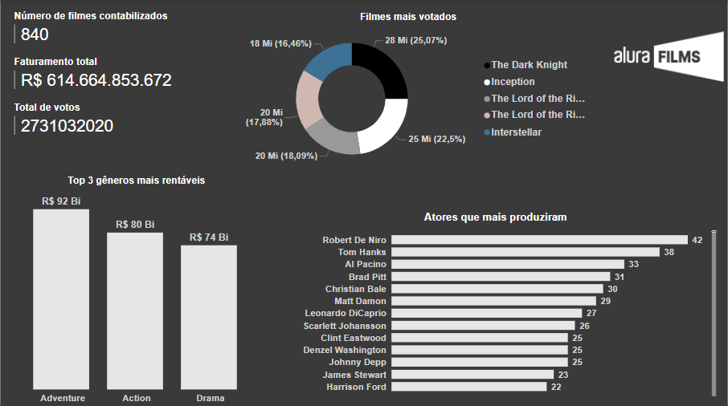
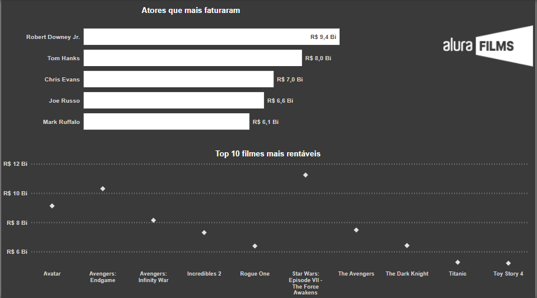
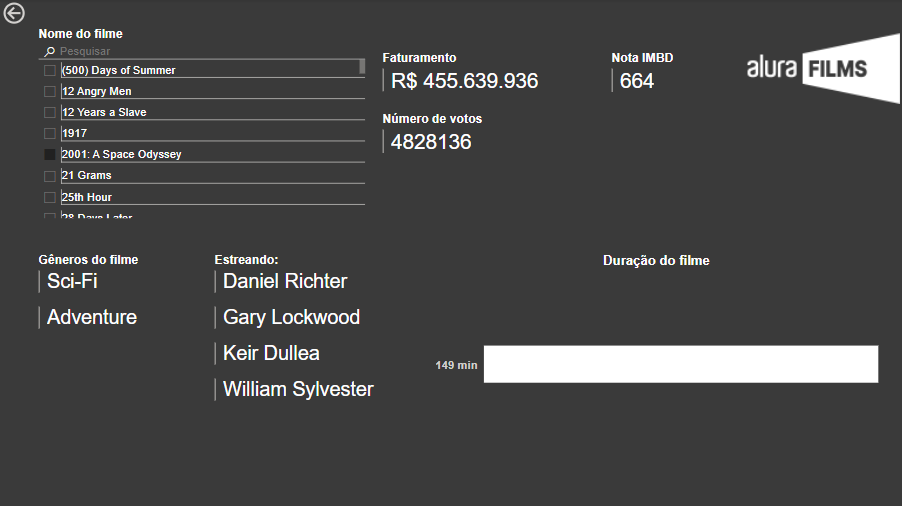

# challenge-bi-2-alurafilms
**
 Challenge BI 2 Semana 1 da Alura 
**  
O projeto em questão foi um challenge proposto pela Alura com o seguinte case:  
A Alura Films contratou você para fazer uma pesquisa de mercado, com a finalidade de identificar a seleção ideal de elenco e produção. Para isso, ela disponibilizou uma base de dados do IMDB com 1000 filmes.
Use suas habilidades e conhecimentos para explorar, tratar e transformar os dados em informações relevantes que auxiliem na tomada de decisão da empresa.
O dashboard foi feito em PowerBi, e o resultado são as imagens a seguir: 

  
  

  
  

  

